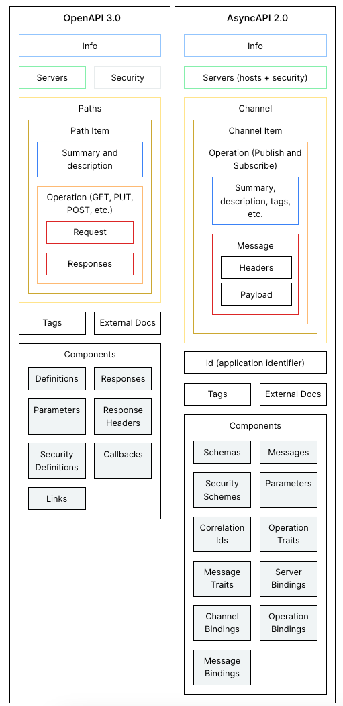
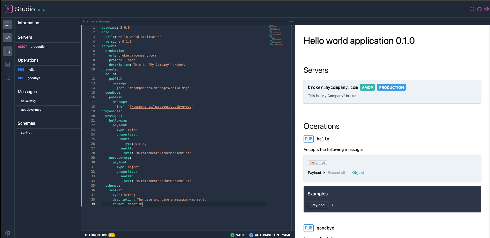

# AsyncAPI Basics


This repository contains information, references, and samples about AsyncAPI.

## AsyncAPI: Why? What?

[AsyncAPI](https://www.asyncapi.com/) is an open source initiative with the goal
of making event-driven APIs as easy as REST APIs. Fundamentally, it is a
**specification** to define an asynchronous APIs, similar to what OpenAPI (aka
Swagger) does for REST APIs.

AsyncAPI also provides **tools to visualize and validate** AsyncAPI specs and
**generators** to generate code from the spec in various languages and frameworks.

## Specs and schemas

You can see all the previous and current [specs of
AsyncAPI](https://www.asyncapi.com/docs/reference). Specs for the latest and
pre-release versions:

* [2.6.0 Spec](https://www.asyncapi.com/docs/reference/specification/v2.6.0): The
  latest official spec.
* [3.0.0 Spec](https://www.asyncapi.com/docs/reference/specification/v3.0.0-next-major-spec.10):
  The in-progress pre-release spec.

You can also validate the AsyncAPI documents with the [AsyncAPI JSON Schema
definitions](https://github.com/asyncapi/spec-json-schemas/tree/master/schemas).
Schema for the latest version:

* [2.6.0 Schema](https://github.com/asyncapi/spec-json-schemas/blob/master/schemas/2.6.0.json).

## Concepts

These are the main concepts in AsyncAPI:

* **Server (Broker)**: An infrastructure that receives messages and delivers them
to those interested. They often store messages until delivered. Example brokers
are RabbitMQ, Apache Kafka, Solace, etc.

* **Protocol**: How information is exchanged between applications and channels
  such as *WebSockets*, *HTTP*, *Kafka*, *MQTT*, *Google Pub/Sub* and more.

* **Channel**: An addressable component created by the server to organize
  transmission of messages between producers and consumers. Channels can be
  defined as a *topic*, *queue*, *routing key*, *path*, or *subject* depending
  on the protocol used.

* **Application**: A producer or a consumer that support the selected protocol
  to exchange messages with the server.

* **Producer (Publisher)**: An application that send messages to a channel.

* **Consumer (Subscriber)**: An application that consumers for messages from a
  channel.

* **Message**: A message is the mechanism to exchange information between
  servers and applications via a channel serialized in the format specified by
  the protocol. It can support multiple patters such as *event* (to communicate
  that a fact has occurred), *command* (to instruct subscriber to do something),
  request or response.

* **Bindings**: Server, channel, operation, and messaging bindings allow
  protocol-specific information, e.g. `Google Cloud Pub/Sub Server Binding`,
  `Google Cloud Pub/Sub Channel Binding`, `Google Cloud Pub/Sub Operation
  Binding`, `Google Cloud Pub/Sub Message Binding`.

## OpenAPI vs. AsyncAPI

If you're coming from OpenAPI and you want to see how it compares to AsyncAPI,
here's a [nice
diagram](https://www.asyncapi.com/docs/tutorials/getting-started/coming-from-openapi)
from the AsyncAPI docs.



## How does an AsyncAPI spec look like?

[hello-world1.yaml](https://github.com/meteatamel/asyncapi-basics/blob/main/samples/hello-asyncapi/hello-world1.yaml)
is the simplest AsyncAPI possible. It's an application that has a single `hello`
channel. Users can publish messages to this channel and the message payload is
simply a string.

```yaml
# The simplest AsyncAPI spec possible
asyncapi: 2.6.0
info:
  title: Hello world application
  version: '0.1.0'
channels:
  hello:
    publish:
      message:
        payload:
          type: string
```

[hello-world2.yaml](https://github.com/meteatamel/asyncapi-basics/blob/main/samples/hello-asyncapi/hello-world2.yaml)
is a more complicated AsyncAPI definition with servers, channels, components and
schemas.

## Publish vs. Subscribe semantics in AsyncAPI

In a channel, you can have `publish` and `subscribe` operations. This can be
confusing, depending on which perspective you're considering (server vs. user)
and what you're comparing against (eg. WebSocket).

| AsyncAPI Term | WebSocket Term | From Server Perspective | From User Perspective |
| --- | --- | --- | --- |
| Publish | Send | The server receives the message | The user publishes/sends the message to the server |
| Subscribe | Receive | The server publishes the message | The user subscribes/receives the message from the server |

It's most useful to think of `publish` and `subscribe` from user's perspective. You can read [Demystifying the Semantics of Publish and
Subscribe](https://www.asyncapi.com/blog/publish-subscribe-semantics) for more
details.

## Tools

These are some of the useful tools for AsyncAPI:

* [AsyncStudio](https://studio.asyncapi.com/): Browser based tool to author and
  visualize and validate AsyncAPI files.
* [AsyncAPI CLI](https://github.com/asyncapi/cli): CLI based tool to work with
  AsyncAPI files.
* [AsyncAPI Generator](https://github.com/asyncapi/generator): A number of code
  generators for various languages and frameworks.

AsyncStudio is especially useful tool to author, visualize and validate AsyncAPI
files. Here's the previous sample visualized in AsyncStudio:



## Samples

AsyncAPI has some basic samples in
[spec/examples](https://github.com/asyncapi/spec/tree/master/examples) folder.

More samples in this repo in [samples](./samples/) folder:

* [hello-asyncapi](samples/hello-asyncapi) - HelloWorld samples for AsyncAPI.
* [quickstart](samples/quickstart) - Shows how to generate an AsyncAPI spec,
  validate it and generate code from it using AsyncAPI tools.
* [account-email-services](samples/account-email-services/) - Show how to author
  an AsyncAPI spec for a simple 2 microservices architecture.
* [account-service-cloudevent](samples/account-service-cloudevents/) - Shows
  AsyncAPI specs for a service that accepts CloudEvents in binary and structured
  formats.
* [google-pubsub](samples/google-pubsub/) - Shows AsyncAPI spec for Google Cloud
  Pub/Sub.

## References

These are some references I found useful in my research:

* [AsyncAPI home](https://www.asyncapi.com/)
* [AsyncAPI GitHub](https://github.com/asyncapi)
* [AsyncAPI Spec](https://www.asyncapi.com/docs/reference)
* [AsyncAPI Spec Examples](https://github.com/asyncapi/spec/tree/master/examples)
* [Demystifying the Semantics of Publish and Subscribe](https://www.asyncapi.com/blog/publish-subscribe-semantics)
* [Understanding AsyncAPIs with a Practical Example](https://medium.com/event-driven-utopia/understanding-asyncapis-with-a-practical-example-ee2b4be221d8)
* [Simulating CloudEvents with AsyncAPI and
  Microcks](https://developers.redhat.com/articles/2021/06/02/simulating-cloudevents-asyncapi-and-microcks#)
