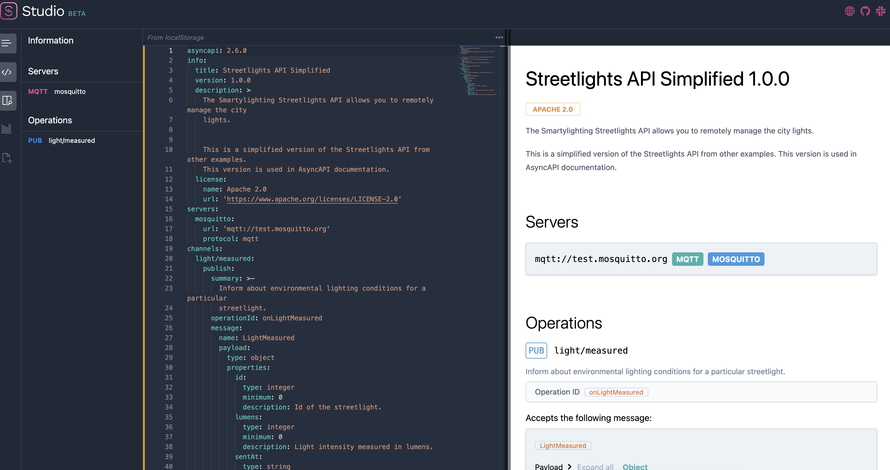

# Quickstart

This sample shows how to generate an AsyncAPI spec, validate it, and generate
code from it using AsyncAPI tools.

## AsyncAPI CLI

[AsyncAPI CLI](https://www.asyncapi.com/tools/cli) is a CLI tool to create,
validate, and explore your AsyncAPI files.

You can install it with `npm` or `brew`:

```sh
npm install -g @asyncapi/cli
```

## AsyncAPI Generator

[AsyncAPI Generator](https://www.asyncapi.com/tools/generator) is another CLI
tool to generate documentation and code from your AsyncAPI files.

You can install it with `npm`:

```sh
npm install -g @asyncapi/generator
```

## MQTT

Install the client library for MQTT protocol as well that we will need later:

```sh
npm install mqtt -g
```

## Generate an AsyncAPI file

Generate an AsyncAPI spec using the AsyncAPI CLI tool that can pull in samples
from [asyncapi/spec/examples](https://github.com/asyncapi/spec/tree/master/examples).

```sh
asyncapi new -n streetlights.yaml
? would you like to start your new file from one of our examples? Yes
? What example would you like to use? Streetlights API Simplified - (protocols: mqtt)
? open in Studio? Yes
Created file streetlights.yaml...
Studio is running at http://localhost:3210?liveServer=3210
Watching changes on file streetlights.yaml
```

This creates a [streetlights.yaml](./streetlights.yaml) file for a simple MQTT
enabled application. It has an MQTT server:

```yaml
servers:
  mosquitto:
    url: mqtt://test.mosquitto.org
    protocol: mqtt
```

And a single channel to publish messages to:

```yaml
channels:
  light/measured:
    publish:
      summary: Inform about environmental lighting conditions for a particular streetlight.
      operationId: onLightMeasured
      message:
        name: LightMeasured
        payload:
          type: object
          properties:
            id:
              type: integer
              minimum: 0
              description: Id of the streetlight.
            lumens:
              type: integer
              minimum: 0
              description: Light intensity measured in lumens.
            sentAt:
              type: string
              format: date-time
              description: Date and time when the message was sent.
```

Once the file is generated, the AsyncStudio opens it automatically and you can
see it visually:



## Validate the AsyncAPI file

You can see in AsyncStudio whether the AsyncAPI file is valid or not.

You can also validate it using the `asyncapi` CLI:

```sh
asyncapi validate streetlights.yaml
...
✖ 5 problems (0 errors, 5 warnings, 0 infos, 0 hints)
```

## Generate code from the AsyncAPI file

You can use AsyncAPI generators to generate code from the AsyncAPI file. For
example, this is how you can generate Node.js code:

```sh
asyncapi generate fromTemplate streetlights.yaml @asyncapi/nodejs-template -o streetlights -p server=mosquitto
```

This generates a Node.js server, in [streetlights](./streetlights/) folder,
capable of receiving MQTT messages outlined in the AsyncAPI file.

You can see the [list of official generator templates](https://github.com/asyncapi/generator#list-of-official-generator-templates) for other languages and frameworks.

## Run the code

Start the generated app:

```sh
cd streetlights
npm install
npm start
```

This starts up the server waiting for MQTT messages:

```sh
> streetlights-api-simplified@1.0.0 start
> node src/api/index.js

 SUB  Subscribed to light/measured
Streetlights API Simplified 1.0.0 is ready! 

🔗  MQTT adapter is connected!
```

In a separate terminal, send a message to the server:

```sh
mqtt pub -t 'light/measured' -h 'test.mosquitto.org' -m '{"id": 1, "lumens": 3, "sentAt": "2022-06-07T12:34:32.000Z"}'
```

You should see that the server received the message:

```sh
← light/measured was received:
{ id: 1, lumens: 3, sentAt: '2022-06-07T12:34:32.000Z' }
```
